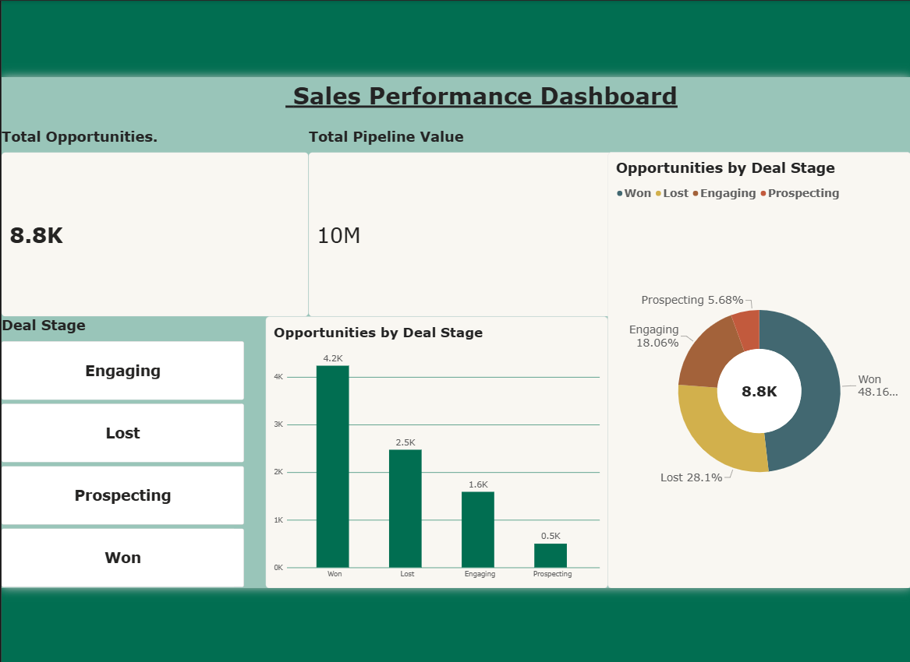
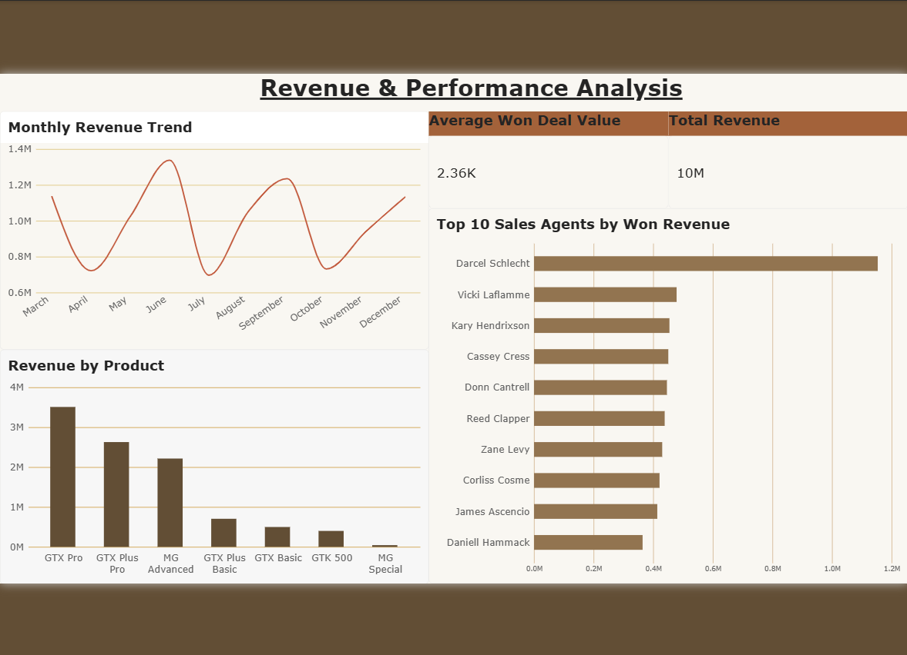
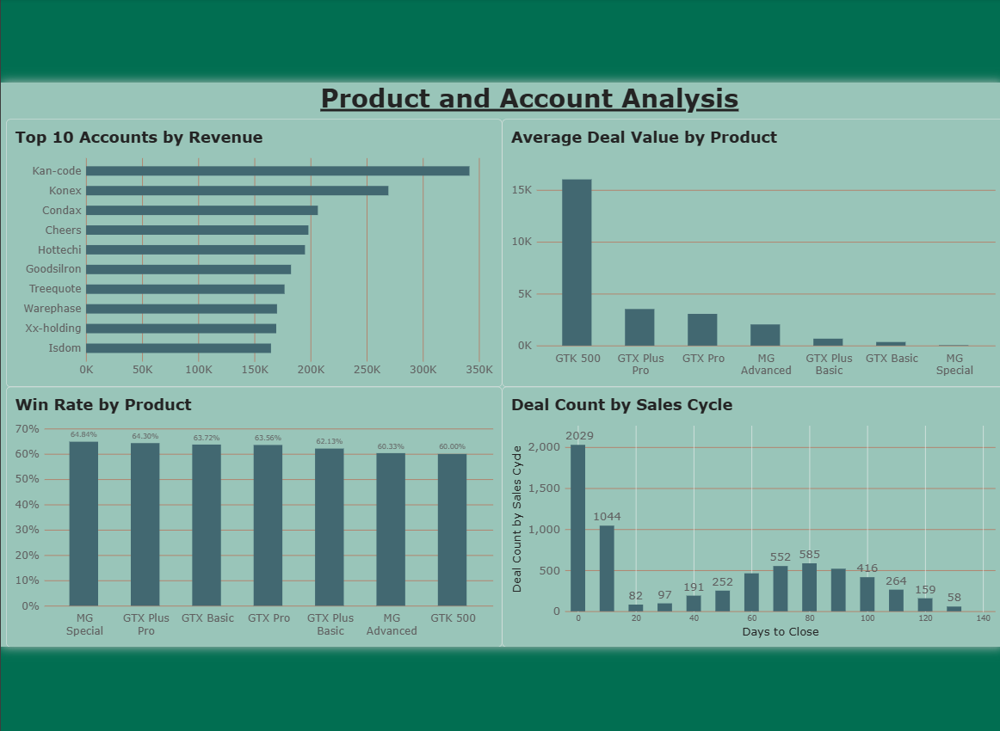

# 📊 CRM Sales Pipeline Analytics

An end-to-end **Data Analytics project** focused on understanding how a company's sales pipeline is performing — from opportunities entering the pipeline to their final outcome.

The project combines **Python, Pandas, PostgreSQL, SQL, and Power BI** to clean CRM data, analyze sales performance, and transform the findings into an interactive dashboard.

---

## 🔎 Overview

Sales teams generate a large amount of CRM data, but raw opportunity records don't immediately show where the sales process is performing well or where deals are getting stuck.

For this project, I worked with CRM data covering **accounts, products, sales opportunities, and sales teams**. The objective was to organize the data, perform meaningful analysis, and build a dashboard that makes important sales patterns easier to understand.

### 🔄 Overall Workflow

**Raw Data → Python/Pandas → PostgreSQL → SQL Analysis → Power BI**

---

## 🎯 Business Questions

Instead of focusing only on creating charts, the analysis was built around practical sales questions:

* How large is the current sales pipeline?
* How are opportunities distributed across different sales stages?
* How much value is generated from won deals?
* Which products and accounts contribute the most?
* How are sales representatives performing?
* Where are opportunities being lost?
* What does the overall sales funnel look like?
* Which areas of the pipeline may require more attention?

---

## 🗂️ Dataset

The project uses four related datasets:

| Dataset          | Description                                |
| ---------------- | ------------------------------------------ |
| `accounts`       | Company and account information            |
| `products`       | Product and pricing information            |
| `sales_pipeline` | Opportunity-level sales pipeline data      |
| `sales_teams`    | Sales representatives and team information |

A **data dictionary** is also included to document the available fields.

Both the original and cleaned datasets are included in the repository so that the data preparation process can be followed from start to finish.

---

## 🧹 Data Preparation

I used **Python and Pandas** to prepare the data before loading it into PostgreSQL.

The preparation process included:

* Inspecting the datasets and their structure
* Checking data types
* Identifying missing values
* Checking for duplicate records
* Reviewing numerical distributions
* Standardizing the data where required
* Creating cleaned datasets for further analysis

The cleaned datasets are available in:

```text
Data/Cleaned/
```

---

## 🐍 Python Analysis

Python was mainly used for **data cleaning, exploration, and preparation** before moving the data into PostgreSQL.

The analysis included:

* Loading and inspecting the raw datasets
* Exploring categorical and numerical columns
* Checking missing values and duplicate records
* Reviewing basic statistics and data distributions
* Identifying inconsistencies in the data
* Preparing the datasets for database analysis
* Exporting the cleaned datasets for further use

### Libraries Used

* **Pandas** — Data manipulation and cleaning
* **NumPy** — Numerical operations
* **Matplotlib** — Basic data visualization

---

## 🗄️ PostgreSQL Database

After cleaning the datasets, I loaded the data into **PostgreSQL** to create a structured environment for further analysis.

The database contains separate tables for:

* Accounts
* Products
* Sales Pipeline
* Sales Teams

Using PostgreSQL made it easier to work with related datasets and perform analysis using SQL.

---

## 🔍 SQL Analysis

SQL was used to answer the main business questions and identify useful patterns in the sales pipeline.

The analysis focused on:

* Sales opportunities by stage
* Won and lost opportunities
* Total and average deal values
* Product-level performance
* Account-level performance
* Sales representative performance
* Pipeline distribution
* Conversion and win patterns

The analysis used several SQL concepts, including:

* `JOIN`
* `GROUP BY`
* Aggregate functions
* Subqueries
* `CASE` statements
* Filtering and conditional logic

---

## 📊 Power BI Dashboard

The final analysis was presented through an interactive **Power BI dashboard**.

The dashboard was designed to provide a quick overview of overall sales performance while allowing deeper analysis of the sales pipeline.

### 📌 Dashboard Areas

#### Overall Sales Performance

* Total opportunities
* Won deals
* Lost deals
* Pipeline value

#### Sales Pipeline

* Opportunity distribution by stage
* Sales funnel
* Pipeline progression

#### Product & Account Analysis

* Top-performing products
* Highest-value accounts
* Deal contribution

#### Sales Team Performance

* Performance by sales representative
* Opportunities handled
* Won and lost deals

The dashboard helps transform the SQL analysis into a visual and easier-to-understand view of the sales pipeline.

---

## 📸 Dashboard Preview

The final analysis was brought together in Power BI through a set of interactive dashboard pages. Each page focuses on a different part of the sales pipeline and makes the analysis easier to explore.

### 📊 Sales Performance

This page provides an overview of sales activity, including opportunities, deal outcomes, and overall pipeline performance.

![Sales Performance Dashboard]---

## 📸 Dashboard Preview

The final analysis was brought together in Power BI through a set of interactive dashboard pages. Each page focuses on a different part of the sales pipeline and makes the analysis easier to explore.

### 📊 Sales Performance

This page provides an overview of sales activity, including opportunities, deal outcomes, and overall pipeline performance.



### 💰 Revenue & Performance

This page focuses on revenue-related metrics and helps understand how sales performance varies across the pipeline.



### 📦 Product & Account Analysis

This page looks at product and account-level performance to identify where the highest-value opportunities and contributions are coming from.



---

## 🛠️ Tools & Technologies

| Tool                | Purpose                                  |
| ------------------- | ---------------------------------------- |
| 🐍 **Python**       | Data cleaning and exploration            |
| 🐼 **Pandas**       | Data manipulation and preparation        |
| 🔢 **NumPy**        | Numerical operations                     |
| 🗄️ **PostgreSQL**  | Database storage and management          |
| 🔎 **SQL**          | Business analysis and querying           |
| 📊 **Power BI**     | Interactive dashboards and visualization |
| 🌐 **Git & GitHub** | Version control and project management   |

---

## 📁 Project Structure

```text
CRM-Sales-Pipeline-Analytics/
│
├── 📂 Data/
│   ├── 📂 Raw/
│   ├── 📂 Cleaned/
│   └── 📂 Data_Dictionary/
│
├── 📂 Python/
│   └── Data cleaning and analysis notebooks
│
├── 📂 SQL/
│   ├── Database setup
│   └── Analysis queries
│
├── 📂 PowerBI/
│   └── Power BI dashboard
│
└── 📄 README.md
```

---

## 📈 Key Outcome

The project follows a complete analytics workflow:

**Data Preparation → Database Management → Business Analysis → Data Visualization**

By combining **Python, SQL, PostgreSQL, and Power BI**, the project demonstrates how raw CRM data can be transformed into structured analysis and actionable sales insights.

---

## 🚀 Future Improvements

Possible future enhancements include:

* Adding time-based sales trend analysis
* Building more detailed sales funnel metrics
* Adding predictive sales forecasting
* Analyzing sales representative conversion rates
* Adding interactive drill-through pages in Power BI
* Automating the data refresh pipeline

---

## 👤 Author

**Naveen Sharma**

B.Tech Computer Science & Engineering
Interested in **Data Analytics, SQL, Python, and Business Intelligence**

---

⭐ If you found this project useful, consider giving the repository a star.
